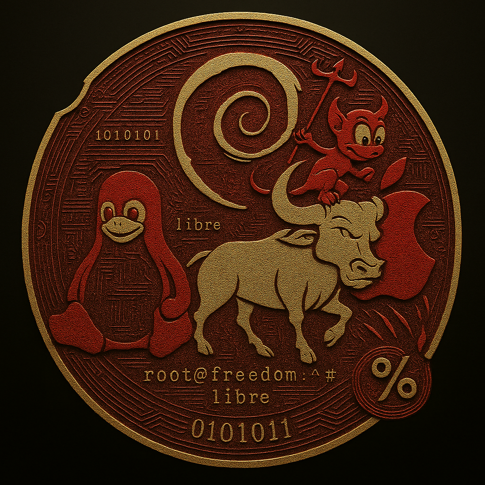

<div align="center">



<br/>

# $FOSS — Free Open Source Soft

**A Solana SPL token I built, deployed on mainnet, listed on a DEX, and documented end-to-end.**

<br/>

[](https://explorer.solana.com/address/64AcKtFgExrtJWPJVr6U4iQrJ1VpiUvDHvRtdMHAcoin)
[](https://explorer.solana.com/tx/VQT5gJrktGkJNuSChKwnfQNeni4ULDLfgHV4bfspBTsZj44v6Wxqc6nGCZze7Mg66atQEmzuVf5MgyUBC9iGroN)
[](https://explorer.solana.com/address/64AcKtFgExrtJWPJVr6U4iQrJ1VpiUvDHvRtdMHAcoin)
[](https://explorer.solana.com/address/64AcKtFgExrtJWPJVr6U4iQrJ1VpiUvDHvRtdMHAcoin)
[](https://www.orca.so/pools/3Ub4ojhVSiMZtmrS8bHSEiMo9oqzauTyYtd3HjFbZnE2)

<br/>


</div>

---

## Why I Built This

In 1983, [Richard Stallman](https://stallman.org/) declared that software should be free — not free as in price, but free as in freedom. Free to run, study, modify, and share. That declaration became the GNU Project, the GPL license, and the philosophical foundation that the Linux kernel was eventually built on.

The internet today runs almost entirely on the output of that movement. Linux, Git, OpenSSL, Python, GCC — tools maintained largely by volunteers or small underfunded teams with no real financial model behind them.

I've used these tools every day as a developer. At some point the question became unavoidable: *blockchain is supposed to be this open, permissionless, transparent system — is there a way to use it to represent and route real value back to the people building FOSS?*

That question became `$FOSS`.

The token's description, stored permanently on IPFS:

> *"FOSS Coin is a community-created token built to support and promote Free and Open Source Software. It can be used to donate to FOSS projects, reward developers and contributors, and raise awareness about digital privacy, Linux, and open technologies."*

Not affiliated with the FSF, GNU, or Linux.org. Built independently by me — to ask that question on a live network, not just in theory.

---

## Token

| Property | Value |
|---|---|
| **Symbol** | `FOSS` |
| **On-chain Name** | `Free Open Source Soft ` |
| **Network** | Solana Mainnet |
| **Mint Address** | `64AcKtFgExrtJWPJVr6U4iQrJ1VpiUvDHvRtdMHAcoin` |
| **Token Standard** | SPL Token — `TokenkegQfeZyiNwAJbNbGKPFXCWuBvf9Ss623VQ5DA` |
| **Decimals** | `6` |
| **Total Supply** | `1,000,000,000` (raw on-chain: `1,000,000,000,000,000` ÷ 10⁶) |
| **Mint Authority** | `null` — revoked at creation, enforced by Solana runtime |
| **Freeze Authority** | `null` — revoked |
| **Metadata** | Metaplex Token Metadata v3 → [IPFS JSON](https://ipfs.io/ipfs/QmNaaTSFFy4ZBp95vhA8F8MCoYHu9tmzWgcW16YyQcni9n) |
| **Token Logo** | [IPFS PNG ~2.5MB](https://ipfs.io/ipfs/QmZjM3DiAsnwzVPBD2zNzDN518fJqTCmmw41u2bfRZFJMf) |
| **DEX** | Orca Whirlpool — `3Ub4ojhVSiMZtmrS8bHSEiMo9oqzauTyYtd3HjFbZnE2` |
| **Trading Pair** | FOSS / Wrapped SOL |
| **Live Since** | July 23, 2025 |

---

## What I Did — End to End

### July 23, 2025 — Token Deployed on Solana Mainnet

One atomic transaction. Seven steps in a single block at slot `355,223,383`:

```
1. System Program          →  allocated 82-byte mint account on-chain
2. InitializeMint2         →  6 decimals, mint authority initialized
3. Metaplex                →  Create Metadata Accounts v3 — name, symbol, IPFS URI registered on-chain
4. Associated Token Acct   →  ATA created for creator wallet
5. MintTo                  →  1,000,000,000 tokens minted to creator ATA
6. SetAuthority → None     →  mint authority permanently revoked — irreversible
7. Launchpad Buy           →  35,765.474485 FOSS purchased immediately via launchpad
```

Mint authority was revoked **in the same transaction as creation**. The supply was sealed at the consensus level before the transaction even settled. Nobody can mint more — not me, not anyone.

**Fee payer / creator:** `HLwsSkx8v7z25N6aZo6rjAywJ1YfjjwhpCA7fCD1Db2b`
**Creation TX:** [`VQT5gJr...C9iGroN`](https://explorer.solana.com/tx/VQT5gJrktGkJNuSChKwnfQNeni4ULDLfgHV4bfspBTsZj44v6Wxqc6nGCZze7Mg66atQEmzuVf5MgyUBC9iGroN)

---

### October 21, 2025 — Listed on Orca Whirlpool

**Pool creation** — slot `374,850,194`, `14:13:04 UTC`:
- `InitializePoolWithAdaptiveFee` via Orca Whirlpool program
- Tick arrays initialized for price range management
- Pool: `3Ub4ojhVSiMZtmrS8bHSEiMo9oqzauTyYtd3HjFbZnE2`

**Liquidity added** — 19 seconds later, slot `374,850,239`:
- Position NFT minted (Token-2022): `8RVfhVxFGUo5uJKcMZQUu6MD7FhLH8v8WFRaxsT3doxY`
- `IncreaseLiquidityV2` — deposited `2.900653 FOSS` + `0.0004 SOL`

Orca Whirlpool is a concentrated liquidity AMM — not a standard constant-product pool. Liquidity sits within defined price tick ranges. I read the raw pool account state (`sqrtPrice`, `tickCurrentIndex`, `liquidity`) directly from the chain.

**Pool TX:** [`5obapS...tWiB`](https://explorer.solana.com/tx/5obapSAxEfqkkQCJaYxCkLZb8dub5vthyk2eBqN56akHmAtVVC12nBbsYQXmbPZgQWexUArRnJrsk3dt86hXtWiB)
**Liquidity TX:** [`2xR9TX...JEGm`](https://explorer.solana.com/tx/2xR9TXLpkjZPTd5BjCS58Xzwqw7X2wCLDZW2ZsWFnbH7sEkvxToxHKTDNA6r9Dto9rQLS7b5XXe5GhkJQDFmJEGm)

---

### January 18, 2026 — Airdrops

Distributed `$FOSS` tokens to wallets using `TransferChecked` — the SPL instruction that enforces decimal precision at the protocol level on every transfer.

---

## All Transactions

| # | Date (UTC) | What Happened | Link |
|---|---|---|---|
| 1 | 2025-07-23 07:43:36 | Token creation — mint, metadata, 1B supply, mint authority revoked, initial buy | [View](https://explorer.solana.com/tx/VQT5gJrktGkJNuSChKwnfQNeni4ULDLfgHV4bfspBTsZj44v6Wxqc6nGCZze7Mg66atQEmzuVf5MgyUBC9iGroN) |
| 2 | 2025-08-17 07:32:10 | Transfer — 2 FOSS to external wallet | [View](https://explorer.solana.com/tx/3BmzHVUWbFinDcRK9gKK4kFovLattTP8k411Yke2amD3vhiLhzGr99RxpQFfSHCKNiu1JjEJK2KMVjxkJup5K29g) |
| 3 | 2025-10-21 14:13:04 | Orca Whirlpool pool creation | [View](https://explorer.solana.com/tx/5obapSAxEfqkkQCJaYxCkLZb8dub5vthyk2eBqN56akHmAtVVC12nBbsYQXmbPZgQWexUArRnJrsk3dt86hXtWiB) |
| 4 | 2025-10-21 14:13:23 | Liquidity provision — position NFT minted | [View](https://explorer.solana.com/tx/2xR9TXLpkjZPTd5BjCS58Xzwqw7X2wCLDZW2ZsWFnbH7sEkvxToxHKTDNA6r9Dto9rQLS7b5XXe5GhkJQDFmJEGm) |
| 5 | 2026-01-18 12:59:51 | Airdrop — 1 FOSS | [View](https://explorer.solana.com/tx/4Xu9TWvWCoxnye7ZTr1kswaMnyLUiVoWZnccu1dASuMMMtz6aJd6AAtpxiAPwULa3Kp6JUkxAMEGsjcNrnVtTREq) |
| 6 | 2026-01-18 13:19:03 | Airdrop — 1 FOSS | [View](https://explorer.solana.com/tx/4CchR52nCrirsLaViyM2vfvqraPYfkWhnb54gkfAQ78AisQqKUM4geiZg82oHwVqNFWTjxF693Shjng4Be5Xkj4T) |

---

## Programs Used

| Program | ID | Role |
|---|---|---|
| SPL Token Program | `TokenkegQfeZyiNwAJbNbGKPFXCWuBvf9Ss623VQ5DA` | Core token ops — mint, transfer, authority |
| SPL Token-2022 | `TokenzQdBNbLqP5VEhdkAS6EPFLC1PHnBqCXEpPxuEb` | Orca position NFT |
| Associated Token Account | `ATokenGPvbdGVxr1b2hvZbsiqW5xWH25efTNsLJA8knL` | Auto-creates token accounts per wallet |
| Metaplex Token Metadata | `metaqbxxUerdq28cj1RbAWkYQm3ybzjb6a8bt518x1s` | On-chain name, symbol, IPFS URI |
| Orca Whirlpool | `whirLbMiicVdio4qvUfM5KAg6Ct8VwpYzGff3uctyCc` | Concentrated liquidity DEX |
| Launchpad (custom BPF) | `HtKnLjomtPrjJwyuQe6HApuEcnb76AUp3oG3nTpnQSAr` | Atomic token launch — not pump.fun |
| System Program | `11111111111111111111111111111111` | Account creation, SOL transfers |
| Compute Budget | `ComputeBudget111111111111111111111111111111` | TX compute unit management |

---

## Supply Distribution

| Recipient | Amount | % |
|---|---|---|
| Orca Whirlpool vault | ~999,964,234 FOSS | 99.9964% |
| Creator wallet | ~35,759 FOSS | 0.0036% |
| Airdrops | < 100 FOSS | < 0.001% |

---

## Verify It Yourself

| | Link |
|---|---|
| Token — Solana Explorer | [View](https://explorer.solana.com/address/64AcKtFgExrtJWPJVr6U4iQrJ1VpiUvDHvRtdMHAcoin) |
| Token — Solscan | [View](https://solscan.io/token/64AcKtFgExrtJWPJVr6U4iQrJ1VpiUvDHvRtdMHAcoin) |
| Token — Solana FM | [View](https://solana.fm/address/64AcKtFgExrtJWPJVr6U4iQrJ1VpiUvDHvRtdMHAcoin) |
| Creation TX | [View](https://explorer.solana.com/tx/VQT5gJrktGkJNuSChKwnfQNeni4ULDLfgHV4bfspBTsZj44v6Wxqc6nGCZze7Mg66atQEmzuVf5MgyUBC9iGroN) |
| Orca Pool | [View](https://www.orca.so/pools/3Ub4ojhVSiMZtmrS8bHSEiMo9oqzauTyYtd3HjFbZnE2) |
| GeckoTerminal | [View](https://www.geckoterminal.com/solana/pools/3Ub4ojhVSiMZtmrS8bHSEiMo9oqzauTyYtd3HjFbZnE2) |
| Metadata JSON — IPFS | [View](https://ipfs.io/ipfs/QmNaaTSFFy4ZBp95vhA8F8MCoYHu9tmzWgcW16YyQcni9n) |
| Token Logo — IPFS | [View](https://ipfs.io/ipfs/QmZjM3DiAsnwzVPBD2zNzDN518fJqTCmmw41u2bfRZFJMf) |
| Creator Wallet | [View](https://explorer.solana.com/address/HLwsSkx8v7z25N6aZo6rjAywJ1YfjjwhpCA7fCD1Db2b) |

**Confirm fixed supply via RPC:**

```bash
curl https://api.mainnet-beta.solana.com -X POST \
  -H "Content-Type: application/json" \
  -d '{
    "jsonrpc":"2.0","id":1,
    "method":"getAccountInfo",
    "params":["64AcKtFgExrtJWPJVr6U4iQrJ1VpiUvDHvRtdMHAcoin",{"encoding":"jsonParsed"}]
  }'
```

Look for `"mintAuthority": null` in the response. Runtime-level state — not a setting, not a promise.

---

## Repository Contents

```
foss/
├── README.md
├── foss-logo.png
├── overview.md                    ← token concept, supply, metadata, authorities
├── how-it-was-built.md            ← full creation walkthrough at the instruction level
├── on-chain-verification.md       ← every claim with its direct on-chain source
├── programs.md                    ← all Solana programs involved with roles
├── transactions.md                ← all 6 transactions — slots, dates, descriptions
├── resources.md                   ← every public URL organized by category
├── data/
│   └── token-spec.json            ← structured token data
└── raw/
    ├── mint_account_info.json
    ├── token_supply.json
    ├── mint_signatures.json
    ├── foss_tx_1.json → foss_tx_6.json
    ├── foss_metadata_accounts.json
    ├── foss_token_accounts.json
    ├── foss_pool_account.json
    ├── foss_pool_foss_balance.json
    ├── foss_pool_sol_balance.json
    ├── geckoterminal_token.json
    ├── orca_pool_api.json
    ├── foss_ipfs_metadata.json
    ├── foss_logo.png
    └── *.html                     ← saved explorer HTML snapshots
```

---

## Honest Limitations

- **Low liquidity** — initial pool had ~0.0004 SOL + ~2.9 FOSS. Not practically tradeable at scale.
- **Not on Jupiter** — won't appear in most Solana wallet swap interfaces.
- **No on-chain utility yet** — no transfer hooks, no donation routing, no governance.
- **IPFS dependency** — metadata and logo depend on IPFS availability. Not pinned to Arweave.
- **Creator holds the LP position NFT** — liquidity can be withdrawn. Real centralisation point.
- **Legacy Token Program** — not Token-2022, so no modern extensions.

---

<div align="center">

*The tools that power the internet were built freely and maintained freely.*
*This is a small attempt to think about what that's worth.*

<br/>

Built by [Lingadevaru H P](https://lingadevaru.in)

</div>
